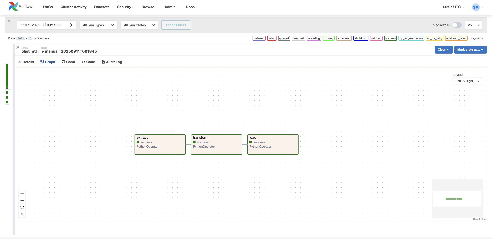
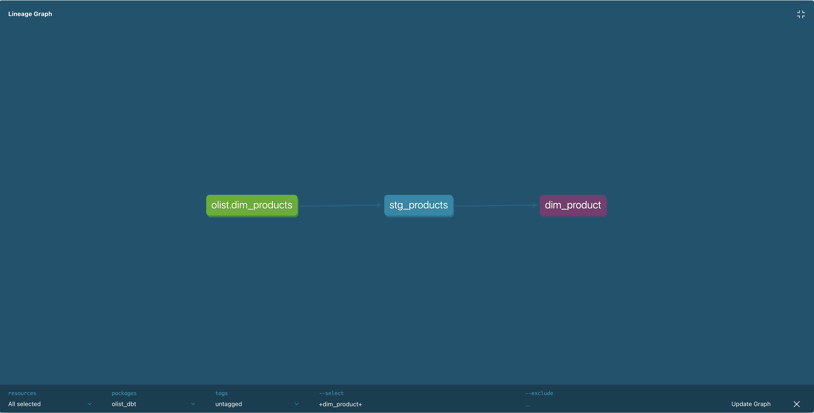
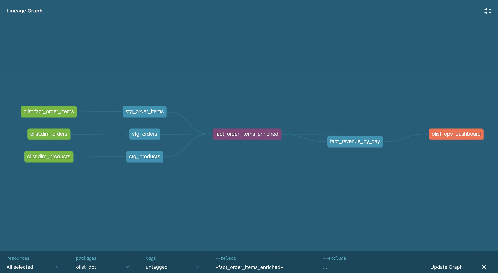
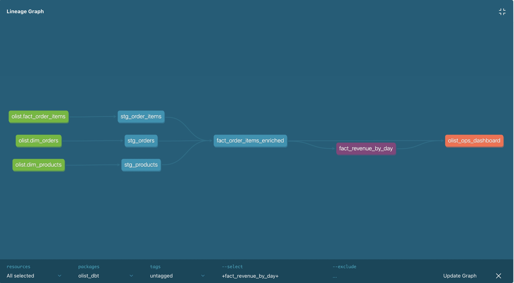
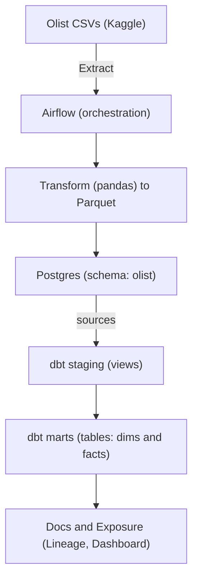

# Olist E-commerce Analytics Pipeline (Airflow + Postgres + dbt)

This is an end-to-end, **production-style** analytics stack on the real **Olist Brazilian E-commerce** dataset.  
It extracts CSVs, transforms them with **pandas**, bulk-loads into **Postgres** using **COPY**, and models the warehouse with **dbt** (tests + lineage + docs).

- **Orchestration:** Apache **Airflow** (Docker)
- **Warehouse:** **Postgres 16** (`olist` schema)
- **Transforms:** **pandas** → **Parquet** handoff → **COPY** to Postgres (fast & reliable)
- **Modeling:** **dbt** (staging, marts, tests, docs & lineage)

> **Why this matters:** Idempotent (safe to re-run), avoids XCom size limits via Parquet handoff, and produces tested, documented models a BI team can use immediately.

---

## ✨ What I Did

- Set up a **Dockerized** stack (Airflow webserver/scheduler + Postgres DW).
- Built an **Airflow DAG** (`extract → transform → load`) with:
  - **Extract:** ingest 5 Olist CSVs (customers, orders, items, payments, products).
  - **Transform:** strong typing + cleaning in **pandas**; write **Parquet** to `data/processed/`.
  - **Load:** fast, reliable **COPY** into Postgres; **UPSERT** dimensions; **TRUNCATE + COPY** facts.
- Solved tricky ingestion issues (pandas/SQLAlchemy `.to_sql` pitfalls) by switching to **COPY**.
- Implemented **idempotent** behavior so reruns don’t fail on unique constraints.
- Modeled the warehouse with **dbt**:
  - **sources → staging → marts** (dims & facts), plus schema/data **tests**.
  - Generated **docs** and **lineage**; added an **exposure** for analytics.
- Added CLI verification steps (row counts, DAG run states) for quick health checks.
- Wrote a recruiter-friendly **README** with architecture, screenshots, and quickstart.

---

## 🔎 Highlights

- **Reliable loads:** Dimensions **UPSERTed**; facts **TRUNCATE + COPY** → repeatable runs.
- **Scales cleanly:** Large payloads don’t go through XCom; tasks pass **file paths** to Parquet.
- **Fast ingestion:** Uses Postgres **COPY** (psycopg2) instead of `DataFrame.to_sql`.
- **Quality & docs:** dbt tests pass; lineage + exposures documented.

---

## 📸 Screenshots

> Files expected under `assets/`. These names match what you already have.

### Airflow DAG (end-to-end)

### dbt Lineage – Overview

### dbt Lineage – Fact build path

### dbt Lineage – Dimension example

---

## 🏗️ Architecture

## 🙌 Credits

- Dataset: **Olist Brazilian E-commerce** (Kaggle)  
- Stack: **Airflow • Postgres • pandas • dbt**

### 🗃️ Warehouse Models

#### Dimensions
- `olist.dim_customers` — city, state, unique customer keys  
- `olist.dim_orders` — status + purchase/approval/delivery timestamps  
- `olist.dim_products` — category & physical attributes  

#### Facts
- `olist.fact_order_items` — item-level price & freight  
- `olist.fact_payments` — payment type, installments, value  

#### Example mart
- `fact_revenue_by_day` (dbt) enriches order items with order & product context for daily revenue analyses and a documented exposure.

### ✅ Reliability Choices
- **Transform → Load interface:** write **Parquet** to `/opt/airflow/data/processed/`; pass **file paths** via XCom (tiny payloads).
- **Load implementation:** bulk-ingest with **COPY**, then:
  - **UPSERT** into `dim_customers`, `dim_orders`, `dim_products`
  - **TRUNCATE + COPY** for `fact_order_items`, `fact_payments`
- **Re-run safety:** design is **idempotent** and avoids common pandas/SQLAlchemy pitfalls.

### 🧪 Testing & Documentation
- dbt **schema tests** (e.g., `not_null`, `relationships`, `accepted_values`) and **data tests** pass.
- `dbt docs generate` builds searchable documentation with **lineage graphs** and **exposures**.
- Optional: publish docs via **GitHub Pages** (copy `dbt/target` → `/docs`, enable Pages).

---

## 🏁 Summary

This project demonstrates a production-style analytics pipeline on a real e-commerce dataset, built with **Airflow**, **pandas**, **Postgres**, and **dbt**. It’s **reproducible**, **documented**, and **safe to re-run**:

- Orchestrated ETL with Airflow: **extract → transform (Parquet) → load (COPY)**
- **Idempotent loads:** UPSERTed dimensions, TRUNCATE+COPY facts
- **Performance & reliability:** Parquet handoff avoids XCom limits; bulk COPY beats `to_sql`
- **Quality & clarity:** dbt tests, lineage, and docs for transparent data modeling
- **Dev-ready:** Dockerized stack, quickstart scripts, and CLI checks for fast evaluation

If you’re reviewing this for hiring: the repo reflects how I design pragmatic, reliable data pipelines focused on correctness first, with clean interfaces, observability, and documentation that teams can trust and extend.
