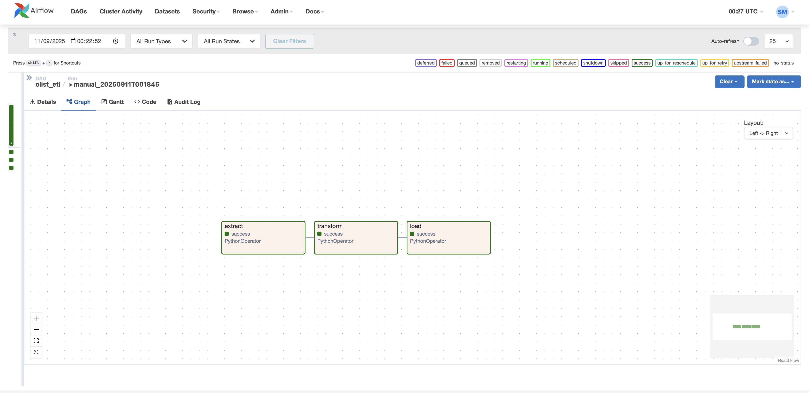

# Olist E-commerce Analytics Pipeline (Airflow + Postgres + dbt)

End-to-end, reproducible analytics stack built on the real **Olist Brazilian E-commerce** dataset.

- **Orchestration:** Apache **Airflow** (Docker)
- **Warehouse:** **Postgres 16** (`olist` schema)
- **Transforms:** **pandas** → Parquet handoff → Postgres **COPY** (fast & reliable)
- **Modeling:** **dbt** (staging, marts, tests, docs & lineage)

> Why it matters: the pipeline is **idempotent** (safe to re-run), scales beyond XCom limits, and produces tested, documented models a BI team can use immediately.

## Screenshots

> Files expected in `assets/`. Rename yours to match or adjust the paths below.

### Airflow DAG (end-to-end success)

### dbt Lineage – Overview

### dbt Lineage – Fact build path

### dbt Lineage – Dimension example

## Architecture

mermaid**
flowchart TD
  A["Olist CSVs (Kaggle)"]
  B["Airflow (orchestration)"]
  C["Transform (pandas) → Parquet"]
  D["Postgres (schema: olist)"]
  E["dbt staging (views)"]
  F["dbt marts (tables: dims & facts)"]
  G["Docs & Exposure (Lineage, Dashboard)"]

  A -->|Extract| B
  B --> C
  C --> D
  D -->|sources| E
  E --> F
  F --> G**

  ## Project structure
  etl_olist_airflow/
├─ dags/
│  └─ olist_etl_dag.py          # extract → transform → load
├─ src/
│  ├─ extract.py                 # read five Olist CSVs
│  ├─ transform.py               # typing, curation, write Parquet
│  └─ load.py                    # COPY + UPSERT dims; reload facts
├─ sql/
│  └─ ddl.sql                    # schema & table DDL (olist.*)
├─ data/
│  ├─ raw/                       # CSVs (gitignored)
│  └─ processed/                 # Parquet from transform
├─ dbt/                          # dbt project (models, tests, docs)
├─ assets/                       # screenshots for this README
├─ docker-compose.yml
├─ requirements.txt
└─ README.md

